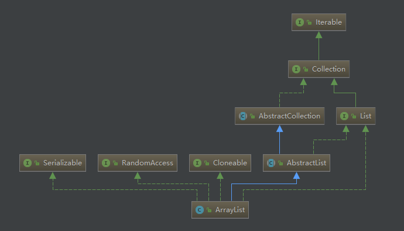
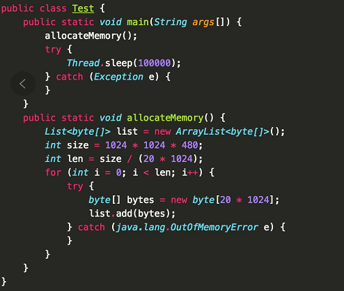

# 单列集合List

## 体系结构


## ArrayList

### 1 继承体系



#### 1.1 继承说明

- ArrayList 是一个数组结构，相当于动态数组。它继承于AbstractList，实现了List, RandomAccess, Cloneable, java.io.Serializable接口。
- ArrayList 继承了AbstractList，实现了List。它是一个数组队列，提供了相关的添加、删除、修改、遍历等功能。
- ArrayList 实现了RandmoAccess接口，即提供了随机访问功能。RandmoAccess是java中用来被List实现，为List提供快速访问功能的。在ArrayList中，我们即可以通过元素的序号快速获取元素对象；这就是快速随机访问。
- ArrayList 实现了Cloneable接口，即覆盖了函数clone()，能被克隆。
- ArrayList 实现java.io.Serializable接口，这意味着ArrayList支持序列化，能通过序列化去传输。
- ArrayList中的操作不是线程安全的，建议在单线程中使用ArrayList(多线程中可以选择Vector或者CopyOnWriteArrayList)

### 2 ArrayList属性

```Java
   // 默认初始的容量
    private static final int DEFAULT_CAPACITY = 10;
   // 空对象
    private static final Object[] EMPTY_ELEMENTDATA = {};
   // 一个空对象，如果使用默认构造函数创建，则默认对象就是它
    private static final Object[] DEFAULTCAPACITY_EMPTY_ELEMENTDATA = {};
   // 存储数据的核心数组，当前对象不参与序列化
    transient Object[] elementData; 
   // 当前数组长度
    private int size;
   /* 数组最大长度
      为什么需要-8：有些虚拟机在数组中保留了一些头信息。尝试分配更大的数组可能会导致OutOfMemoryError内存溢出，为了避免内存溢出。
   */
    private static final int MAX_ARRAY_SIZE = Integer.MAX_VALUE - 8;

```

```Java
/**Jdk 1.7 */
    private static final int DEFAULT_CAPACITY = 10;
    private static final Object[] EMPTY_ELEMENTDATA = {};
    private transient Object[] elementData;
    private int size;
    public ArrayList(int initialCapacity) {
        super();
        if (initialCapacity < 0)
            throw new IllegalArgumentException("Illegal Capacity: "+
                                               initialCapacity);
        this.elementData = new Object[initialCapacity];
    }
    public ArrayList() {
        super();
        this.elementData = EMPTY_ELEMENTDATA;
    }
    public ArrayList(Collection<? extends E> c) {
        elementData = c.toArray();
        size = elementData.length;
        if (elementData.getClass() != Object[].class)
            elementData = Arrays.copyOf(elementData, size, Object[].class);
    }
   public boolean add(E e) {
        ensureCapacityInternal(size + 1);  // Increments modCount!!
        elementData[size++] = e;
        return true;
    }
    public void ensureCapacity(int minCapacity) {
        int minExpand = (elementData != EMPTY_ELEMENTDATA) ? 0: DEFAULT_CAPACITY;
        if (minCapacity > minExpand) {
            ensureExplicitCapacity(minCapacity);
        }
    }

    private void ensureCapacityInternal(int minCapacity) {
        if (elementData == EMPTY_ELEMENTDATA) {
            minCapacity = Math.max(DEFAULT_CAPACITY, minCapacity);
        }
        ensureExplicitCapacity(minCapacity);
    }

    private void ensureExplicitCapacity(int minCapacity) {
        modCount++;
        if (minCapacity - elementData.length > 0)
            grow(minCapacity);
    }
    private static final int MAX_ARRAY_SIZE = Integer.MAX_VALUE - 8;
    private void grow(int minCapacity) {
        // overflow-conscious code
        int oldCapacity = elementData.length;
        int newCapacity = oldCapacity + (oldCapacity >> 1);
        if (newCapacity - minCapacity < 0)
            newCapacity = minCapacity;
        if (newCapacity - MAX_ARRAY_SIZE > 0)
            newCapacity = hugeCapacity(minCapacity);
        // minCapacity is usually close to size, so this is a win:
        elementData = Arrays.copyOf(elementData, newCapacity);
    }

    private static int hugeCapacity(int minCapacity) {
        if (minCapacity < 0) // overflow
            throw new OutOfMemoryError();
        return (minCapacity > MAX_ARRAY_SIZE) ?
            Integer.MAX_VALUE :
            MAX_ARRAY_SIZE;
}
```

#### 2.1 主要成员变量

- elementData ： 动态数组，也就是我们存储数据的核心数组
- DEFAULT_CAPACITY：数组默认长度，在调用默认构造器的时候会有介绍
- size：记录有效数据长度，size（）方法直接返回该值
- MAX_ARRAY_SIZE：数组最大长度，如果扩容超过该值，则设置长度为 Integer.MAX_VALUE
- 从AbstractList继承过来的modCount属性，代表ArrayList集合的修改次数。

### 3 构造方法

**ArrayList** 中提供了三种构造方法：

- ArrayList()
- ArrayList(int initialCapacity)
- ArrayList（Collection c）

根据构造器的不同，构造方法会有所区别。对于**不同的构造器的内部实现都有所区别**，主要跟上述提到的成员变量有关。

#### 3.1 ArrayList（）

在源码给出的注释中这样描述：构造一个初始容量为10的空列表

```Java
 /**
     * Constructs an empty list with an initial capacity of ten.
       为什么说创建一个默认大小为10 的列表呢？
     */
    public ArrayList() {
        this.elementData = DEFAULTCAPACITY_EMPTY_ELEMENTDATA;
    }
```

#### 3.2 ArrayList(int initialCapacity)

根据指定大小初始化 ArrayList 中的数组大小，如果默认值大于0，根据参数进行初始化，如果等于0，指向EMPTY_ELEMENTDATA 内存地址（与上述默认构造器用法相似）。如果小于0，则抛出IllegalArgumentException 异常。

```Java
 public ArrayList(int initialCapacity) {
        if (initialCapacity > 0) {
            this.elementData = new Object[initialCapacity];
        } else if (initialCapacity == 0) {
            this.elementData = EMPTY_ELEMENTDATA;
        } else {
            throw new IllegalArgumentException("Illegal Capacity: "+
                                               initialCapacity);
        }
    }
```

#### 3.3 ArrayList（Collection c）

将Collection<? extends E>  c 中保存的数据，首先转换成数组形式（toArray（）方法），然后判断当前数组长度是否为0，为 0 则使用默认数组（EMPTY_ELEMENTDATA）；否则进行数据拷贝。

```Java
public ArrayList(Collection<? extends E> c) {
        elementData = c.toArray();
        if ((size = elementData.length) != 0) {
            // c.toArray might (incorrectly) not return Object[] (see 6260652)
            if (elementData.getClass() != Object[].class)
                elementData = Arrays.copyOf(elementData, size, Object[].class);
        } else {
            // replace with empty array.
            this.elementData = EMPTY_ELEMENTDATA;
        }
    }
```

#### 3.4 总结

上述的三个构造方法可以看出，其实每个构造器内部做的事情都不一样，特别是默认构造器与 ArrayList(int initialCapacity) 这两个构造器直接的区别 。

- ArrayList（）：指向 **DEFAULTCAPACITY_EMPTY_ELEMENTDATA**，当列表使用的时候，才会进行初始化，会通过判断是不是 DEFAULTCAPACITY_EMPTY_ELEMENTDATA 这个对象而设置数组默认大小。
- ArrayList(int initialCapacity)：当 initialCapacity >0 的时候，设置该长度。如果 initialCapacity =0，则指向 **EMPTY_ELEMENTDATA** 在使用的时候，并不会设置默认数组长度 。

 DEFAULTCAPACITY_EMPTY_ELEMENTDATA 与 EMPTY_ELEMENTDATA 的本质区别就在于，会不会设置默认的数组长度。


```Java
/*
  当列表使用的时候，才会进行初始化大小为10
*/
public boolean add(E e) {
        ensureCapacityInternal(size + 1);  // Increments modCount!!
        elementData[size++] = e;
        return true;
    }
    private void ensureCapacityInternal(int minCapacity) {
        // 如果elementData 指向的是 DEFAULTCAPACITY_EMPTY_ELEMENTDATA 的地址
        if (elementData == DEFAULTCAPACITY_EMPTY_ELEMENTDATA) {
            设置默认大小 为DEFAULT_CAPACITY
            minCapacity = Math.max(DEFAULT_CAPACITY, minCapacity);
        }
        //确定实际容量
        ensureExplicitCapacity(minCapacity);
    }
```

上述代码块比较长，这里做个简单的总结：

1、add（E e）：添加元素，首先会判断 elementData 数组的长度，然后设置值

2、ensureCapacityInternal（int minCapacity）：判断 element 是否为空，如果是，则设置默认数组长度

3、ensureExplicitCapacity（int minCapacity）：判断预期增长数组长度是否超过当前容量，如果过超过，则调用grow（）

4、grow(int minCapacity)：对数组进行扩展

### 4、添加方法

ArrayList 添加了四种添加方法：

- add(E  element)
- add(int i , E element)
- addAll(Collection<? extends E> c)
- addAll(int index, Collection<? extends E> c)

#### 4.1 add(E element)

首先看add（T t）的源码：

```Java
public boolean add(E e) {
        // 元素个数加一，并且确认数组长度是否足够 
        ensureCapacityInternal(size + 1);   // Increments modCount!!
        //在列表最后一个元素后添加数据。
        elementData[size++] = e;
        return true;
    }
```

结合默认构造器或其他构造器中，如果默认数组为空，则会在 ensureCapacityInternal（）方法调用的时候进行数组初始化。这就是为什么默认构造器调用的时候，我们创建的是一个空数组，但是在注释里却介绍为 长度为10的数组。

#### 4.2 add（int i , T t）

```Java
  public void add(int index, E element) {
        // 判断index 是否有效
        rangeCheckForAdd(index);
        // 计数+1，并确认当前数组长度是否足够
        ensureCapacityInternal(size + 1);  // Increments modCount!!
        System.arraycopy(elementData, index, elementData, index + 1,
                         size - index);
        //设置目标数据
        elementData[index] = element;
        size++;
    }
```

这个方法其实和上面的add类似，该方法可以按照元素的位置，指定位置插入元素，具体的执行逻辑如下：

1）确保数插入的位置小于等于当前数组长度，并且不小于0，否则抛出异常

2）确保数组已使用长度（size）加1之后足够存下 下一个数据

3）修改次数（modCount）标识自增1，如果当前数组已使用长度（size）加1后的大于当前的数组长度，则调用grow方法，增长数组

4）grow方法会将当前数组的长度变为原来容量的1.5倍。

5）确保有足够的容量之后，使用System.arraycopy 将需要插入的位置（index）后面的元素统统往后移动一位。

6）将新的数据内容存放到数组的指定位置（index）上

#### 4.3 addAll(Collection<? extends E> c)

```Java
  public boolean addAll(Collection<? extends E> c) {
        Object[] a = c.toArray();
        int numNew = a.length;
        ensureCapacityInternal(size + numNew);  // Increments modCount
        System.arraycopy(a, 0, elementData, size, numNew);
        size += numNew;
        return numNew != 0;
    }
```

addAll() 方法，通过将collection 中的数据转换成 Array[] 然后添加到elementData 数组，从而完成整个集合数据的添加。在整体上没有什么特别之初，这里的collection 可能会抛出控制异常 NullPointerException  需要注意一下。

#### 4.4 addAll(int index，Collection<? extends E> c)

```Java
 public boolean addAll(int index, Collection<? extends E> c) {
        rangeCheckForAdd(index);
        Object[] a = c.toArray();
        int numNew = a.length;
        ensureCapacityInternal(size + numNew);  // Increments modCount
        int numMoved = size - index;
        if (numMoved > 0)
            System.arraycopy(elementData, index, elementData, index + numNew,
                             numMoved);
        System.arraycopy(a, 0, elementData, index, numNew);
        size += numNew;
        return numNew != 0;
    }
```

与上述方法相比，这里主要多了两个步骤，判断添加数据的位置是不是在末尾，如果在中间，则需要先将数据向后移动 collection 长度 的位置。

### 5、删除方法（Remove）

ArrayList 中提供了 五种删除数据的方式：

- remove（int i）
- remove（E element）
- removeRange（int start,int end）
- clear（）
- removeAll（Collection c）

#### 5.1、remove（int i）:

删除数据并不会更改数组的长度，只会将数据从数组种移除，如果目标没有其他有效引用，则在GC 时会进行回收。

```Java
  public E remove(int index) {
        rangeCheck(index); // 判断索引是否有效
        modCount++;
        E oldValue = elementData(index);  // 获取对应数据
        int numMoved = size - index - 1; // 判断删除数据位置
        if (numMoved > 0) //如果删除数据不是最后一位，则需要移动数组
            System.arraycopy(elementData, index+1, elementData, index,
                             numMoved);
        elementData[--size] = null; // 让指针最后指向空，进行垃圾回收
        return oldValue;
    }
```

#### 5.2、remove（E element）:

这种方式，会在内部进行 AccessRandom 方式遍历数组，当匹配到数据跟 Object 相等，则调用 fastRemove（） 进行删除

```Java
 public boolean remove(Object o) {
        if (o == null) {
            for (int index = 0; index < size; index++)
                if (elementData[index] == null) {
                    fastRemove(index);
                    return true;
                }
        } else {
            for (int index = 0; index < size; index++)
                if (o.equals(elementData[index])) {
                    fastRemove(index);
                    return true;
                }
        }
        return false;
    }
```

fastRemove( ):fastRemove 操作与上述的根据下标进行删除其实是一致的。

```Java
private void fastRemove(int index) {
        modCount++;
        // 要覆盖的长度
        int numMoved = size - index - 1;
        if (numMoved > 0)
            /** 从index+1 处开发复制的内容覆盖从index开发的区域，最后一个位置置空即可 */
            System.arraycopy(elementData, index+1, elementData, index,
                             numMoved);
        elementData[--size] = null; // clear to let GC do its work
    }
```

#### 5.3、removeRange（int fromIndex, int toIndex）

该方法主要删除了在范围内的数据，通过System.arraycopy  对整部分的数据进行覆盖即可。

```Java
  protected void removeRange(int fromIndex, int toIndex) {
        modCount++;
        int numMoved = size - toIndex;
        System.arraycopy(elementData, toIndex, elementData, fromIndex,
                         numMoved);
        // clear to let GC do its work
        int newSize = size - (toIndex-fromIndex);
        for (int i = newSize; i < size; i++) {
            elementData[i] = null;
        }
        size = newSize;
 }
```

#### 5.4、clear（）

直接将整个数组设置为 null 

```Java
public void clear() {
        modCount++;
        // clear to let GC do its work
        for (int i = 0; i < size; i++)
            elementData[i] = null;
        size = 0;
    }
```

#### 5.5、removeAll（Collection c）

```Java
  public boolean removeAll(Collection<?> c) {
       // 判断是否为空,为空报空指针异常
        Objects.requireNonNull(c);
        return batchRemove(c, false);
    }
```

主要通过调用：

```Java
 private boolean batchRemove(Collection<?> c, boolean complement) {
      //获取数组指针
        final Object[] elementData = this.elementData;
        int r = 0, w = 0;
        boolean modified = false;
        try {
            for (; r < size; r++)
               //根据 complement 进行判断删除或留下
                if (c.contains(elementData[r]) == complement)
                    elementData[w++] = elementData[r];
        } finally {
            // 进行数据整理
            if (r != size) {
                System.arraycopy(elementData, r,
                                 elementData, w,
                                 size - r);
                w += size - r;
            }
            if (w != size) {
                // clear to let GC do its work
                for (int i = w; i < size; i++)
                    elementData[i] = null;
                modCount += size - w;
                size = w;
                modified = true;
            }
        }
        return modified;
    }
```

在retainAll（Collection c）也有调用，主要作用分别为，删除这个集合中所包含的元素和留下这个集合中所包含的元素。

#### 5.6 删除时的坑

清楚ArrayList 的删除方法后，再结合我们常用的删除方式，进行思考，到底哪些步骤会出问题，我们通常会选择遍历列表，如果匹配，则删除。我们遍历的方式有以下几种：

- foreach()，for()，Iterator遍历：主要出现 ConcurrentModificationException 异常

避免 ConcurrentModificationException 的有效办法是使用 Concurrent包下面的 CopyOnWriteArrayList 


ArrayList中继承了AbstractList中的**modCount**变量，每次对ArrayList进行修改操作（add/remove这样，get不算），它都会将**modCount**这个变量自加一次，所以modCount这个变量表示这个list从创建出来，一共经历了多少次修改操作，如果我们需要遍历某个List拿这个list的迭代器，迭代器初始化时，会用一个expectedModCount变量会记录下这个ArrayList当前的modCount，然后每次调用迭代器的方法时，都会去比对一下迭代器里的expectedModCount是否等于关联的ArrayList的modCount，如果不等，就抛出一个ConcurrentModificationException。设计目的是，ArrayList与它的迭代器都不是线程安全的，ArrayList的迭代器只能在ArrayList不被修改的情况下才能使用，如果获取迭代器后，ArrayList又被修改（无需并发修改，在同一个线程内修改也行），那么迭代器可能会指向一个异常的位置（位置串了一两位都算是好的，如果ArrayList压缩了，可能会引起数组越界的问题）。ArrayList的iterator和listIterator方法返回的迭代器是快速失败的，从而达到快速失败fail-fast的目的，尽量避免不确定的行为。

### 6、扩容

**　在ArrayList内部扩容的调用链为`ensureCapacityInternal(int)` —> `ensureExplicitCapacity(int)`—> `grow(int)`。*

** 只有初始值为DEFAULTCAPACITY_EMPTY_ELEMENTDATA时，第一次添加元素个数小于DEFAULT_CAPACITY时，直接初始elementData的大小为DEFAULT_CAPACITY。而初始值为EMPTY_ELEMENTDATA，会遵循扩容规则*

```Java
 /*
      进行数据增加时都会调用该方法，以确保数组大小足够使用
   */
    private void ensureCapacityInternal(int minCapacity) {
        // 如果elementData 指向的是 DEFAULTCAPACITY_EMPTY_ELEMENTDATA 的地址
        if (elementData == DEFAULTCAPACITY_EMPTY_ELEMENTDATA) {
            设置默认大小 为DEFAULT_CAPACITY
            minCapacity = Math.max(DEFAULT_CAPACITY, minCapacity);
        }
        //确定实际容量
        ensureExplicitCapacity(minCapacity);
    }
    private void ensureExplicitCapacity(int minCapacity) {
        modCount++;
        // 如果超出了容量，进行扩展
        if (minCapacity - elementData.length > 0)
            grow(minCapacity);
    }
    private void grow(int minCapacity) {
        int oldCapacity = elementData.length;
        // 1.5倍扩容
        int newCapacity = oldCapacity + (oldCapacity >> 1);
        if (newCapacity - minCapacity < 0)
            newCapacity = minCapacity;
        if (newCapacity - MAX_ARRAY_SIZE > 0)
            newCapacity = hugeCapacity(minCapacity);
        // minCapacity is usually close to size, so this is a win:
        elementData = Arrays.copyOf(elementData, newCapacity);
    }
  /**
      注：Arrays.copyof底层使用的是 System.arraycopy
  */

   @SuppressWarnings("unchecked")
    public static <T> T[] copyOf(T[] original, int newLength) {
        return (T[]) copyOf(original, newLength, original.getClass());
    }
    public static <T,U> T[] copyOf(U[] original, int newLength, Class<? extends T[]> newType) {
        @SuppressWarnings("unchecked")
        T[] copy = ((Object)newType == (Object)Object[].class)
            ? (T[]) new Object[newLength]
            : (T[]) Array.newInstance(newType.getComponentType(), newLength);
        System.arraycopy(original, 0, copy, 0,
                         Math.min(original.length, newLength));
        return copy;
    }
```


## 总结

ArrayList总体来说比较简单，不过ArrayList还有以下一些特点：

- ArrayList自己实现了序列化和反序列化的方法，因为它自己实现了 private void writeObject(java.io.ObjectOutputStream s)和 private void readObject(java.io.ObjectInputStream s) 方法
- ArrayList基于数组方式实现，容量会自动扩容
- 添加元素时可能要扩容（所以最好预判一下），删除元素时不会减少容量（若希望减少容量，使用trimToSize()方法，List中没有这个方法），删除元素时，将删除掉的位置元素置为null，下次gc就会回收这些元素所占的内存空间。
- 线程不安全
- add(int index, E element)：添加元素到数组中指定位置的时候，需要将该位置及其后边所有的元素都整块向后复制一位
- get(int index)：获取指定位置上的元素时，可以通过索引直接获取（O(1)）
- remove(Object o)需要遍历数组，最后找到对应的下标
- remove(int index)不需要遍历数组，只需判断index是否符合条件即可，效率比remove(Object o)高
- 使用iterator遍历可能会引发多线程异常

### 思考

* 拓展思考1、RandomAccess 接口作用？

  >它是一个标识性接口，为了提升性能，在遍历集合前，我们便可以通过 `instanceof` 做判断， 选择合适的集合遍历方式，当数据量很大时， 就能大大提升性能。
  >
  >```Java
  > if (list instanceof RandomAccess){
  >            System.out.println("实现了RandomAccess接口，不使用迭代器");
  >            for (int i = 0;i < list.size();i++){
  >                System.out.println(list.get(i));
  >            }
  >        }else{
  >            System.out.println("没实现RandomAccess接口，使用迭代器");
  >            Iterator it = list.iterator();
  >            while(it.hasNext()){
  >                System.out.println(it.next());
  >            }
  >        }
  >```


* 拓展思考2、EMPTY_ELEMENTDATA 与 DEFAULTCAPACITY_EMPTY_ELEMENTDATA的作用？

  >从1.7版本开始，new ArrayList<>()和new ArrayList<>(0)，虽然创建后底层内容和容量都一样，但是实际的行为有些细小的差别，那就是这两个在第一次自动扩容时策略不一样。不过这一点影响比较小，基本不影响使用。1.8中使用两个空数组，正如注释所说的，是在优化（避免创建无用的空数组）的同时，保留其扩容初始策略区别。只用一个空数组就不能再优化的同时，继续保持这个小区别了。

* 拓展思考3、ArrayList中elementData为什么被transient修饰？

  >ArrayList中定义了一个数组elementData用来装载对象的， transient用来表示一个域不是该对象序行化的一部分，当一个对象被序行化的时候，transient修饰的变量的值是不包括在序行化的表示中的。但是ArrayList又是可序行化的类，elementData是ArrayList具体存放元素的成员，用transient来修饰elementData，按理说反序列化后的ArrayList丢失了原先的元素，其实玄机在于ArrayList中的两个方法：
  >
  >```Java
  >private void writeObject(java.io.ObjectOutputStream s)
  >        throws java.io.IOException{
  >        // Write out element count, and any hidden stuff
  >        int expectedModCount = modCount;
  >        s.defaultWriteObject();
  >        // Write out size as capacity for behavioural compatibility with clone()
  >        s.writeInt(size);
  >        // Write out all elements in the proper order.
  >        for (int i=0; i<size; i++) {
  >            s.writeObject(elementData[i]);
  >        }
  >        if (modCount != expectedModCount) {
  >            throw new ConcurrentModificationException();
  >        }
  >    }
  >    /**
  >     * Reconstitute the <tt>ArrayList</tt> instance from a stream (that is,
  >     * deserialize it).
  >     */
  >    private void readObject(java.io.ObjectInputStream s)
  >        throws java.io.IOException, ClassNotFoundException {
  >        elementData = EMPTY_ELEMENTDATA;
  >        // Read in size, and any hidden stuff
  >        s.defaultReadObject();
  >        // Read in capacity
  >        s.readInt(); // ignored
  >        if (size > 0) {
  >            // be like clone(), allocate array based upon size not capacity
  >            ensureCapacityInternal(size);
  >            Object[] a = elementData;
  >            // Read in all elements in the proper order.
  >            for (int i=0; i<size; i++) {
  >                a[i] = s.readObject();
  >            }
  >        }
  >    }
  >/**
  >ArrayList在序列化的时候会调用writeObject，直接将size和element写入ObjectOutputStream；反序列化时调用readObject，从ObjectInputStream获取size和element，再恢复到elementData。
  >采用上诉的方式来实现序列化原因在于elementData是一个缓存数组，它通常会预留一些容量，等容量不足时再扩充容量，那么有些空间可能就没有实际存储元素，采用上诉的方式来实现序列化时，就可以保证只序列化实际存储的那些元素，而不是整个数组，从而节省空间和时间。
  >*/
  >```

### 可能会引发的问题

* 案例： 

大概现象是，系统一直在做cms gc，但是老生代一直不降下去，但是执行一次`jmap -histo:live`之后，也就是主动触发一次full gc之后，通过`jstat -gcutil`来看老生代一下就降下去了，初看下理论上不太可能，因为full gc也会对old做回收，于是我要同事针对他们的场景写了一个简单的demo出来，然后果然还真能重现，不过他的demo设置的Heap有32G，于是我通过慢慢调整，最终在很小的内存下也能重现出来



#### 数组扩容

ArrayList里的数组扩容，使用的是`System.arrayCopy`调用，这是一个native方法，在java层面创建一个新的长度的数组，然后将老数组和新数组都传进去，在native里将老数组里的元素指针拷贝到新数组里，其实做的是浅拷贝，在垃圾回收的时候，List对象可以被回收了，但是List里的数组可能就不被回收，这个数组里的byte数组都没有被回收

> ```Java
> 1） elementData = Arrays.copyOf(elementData, newCapacity) 
> 2）   @SuppressWarnings("unchecked")
>     public static <T> T[] copyOf(T[] original, int newLength) {
>         return (T[]) copyOf(original, newLength, original.getClass());
>     }
> 3） public static <T,U> T[] copyOf(U[] original, int newLength, Class<? extends T[]>      newType) {
>         @SuppressWarnings("unchecked")
>         T[] copy = ((Object)newType == (Object)Object[].class)
>             ? (T[]) new Object[newLength]
>             : (T[]) Array.newInstance(newType.getComponentType(), newLength);
>         System.arraycopy(original, 0, copy, 0,
>                          Math.min(original.length, newLength));
>         return copy;
>     }
> ```
>
> 

#### 旧数组回收

存在跨代引用的情况下，传给`System.arrayCopy`的新数组是在java层面构建传进来的，在新生代分配的可能性最大，这样再加上拷贝仅仅是浅拷贝，那么年老代里的byte数组的引用存在新生代里新数组，那仅仅做CMS GC就不可能回收这些老生代的对象了，因为CMS GC的一个gc root就是新生代里的对象

#### 解决方案

只要保证在cms gc回收old之前做一次ygc就能保证新生代里的那个新数组被回收而没有指向老生代那些byte数组，那么这些数组就能正常被cms gc回收了，所以加上`-XX:+CMSScavengeBeforeRemark`即可解此问题

- List里新数组在新生代分配
- 通过老生代使用率达到了阈值触发的CMS GC，会把新生代里的对象作为GC ROOT的一部分，从而阻止了那些byte数组被回收
- 通过-XX:+CMSScavengeBeforeRemark这个参数可以解决这个问题


