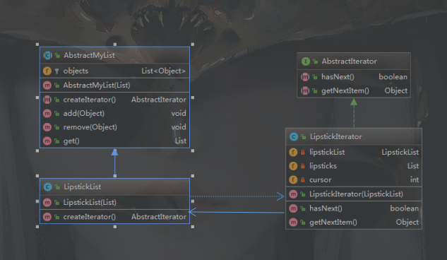

#### 1.简述迭代器模式
举个栗子说一下迭代器模式：就像电视机，里面有很多频道，我们可以通过按电视机上面的按钮来挨个切换频道。同样的，我们也可以通过遥控板左切或又切频道，甚至遥控板还提供了一个数字功能，我们可以通过输入数字获取到该数字对应的频道，遥控器我们就可以看作是迭代器。 
 **迭代器模式定义：** 提供一种方法来访问聚合对象，而不用暴露这个对象的内部表示，其别名为游标(Cursor)。迭代器模式是一种对象行为型模式。
 **迭代器模式结构** 

 **在迭代器模式结构图中包含如下几个角色：** 
 - Iterator（抽象迭代器）：它定义了访问和遍历元素的接口，声明了用于遍历数据元素的方法。
 - Concrete Iterator（具体迭代器）：具体迭代器角色要实现迭代器接口，并且要记录遍历中的当前位置。
 - Aggregate（抽象聚合类）：用于存储和管理元素对象，声明一个createIterator()方法用于创建一个迭代器对象，充当抽象迭代器工厂角色。
 - ConcreteAggregate（具体聚合类）：它实现了在抽象聚合类中声明的createIterator()方法，该方法返回一个与该具体聚合类对应的具体迭代器ConcreteIterator实例。
 
 #### 2.代码示例
 ##### 2.1通过引用的方式实现迭代器对聚合对象中的数据的操作
 **抽象迭代器**
 ~~~ java
public interface AbstractIterator {
    /**
    * 移至下一个元素
    */   
    boolean hasNext(); 
    /**
    * 获取下一个元素
    * @return
    */ 
    Object getNextItem();
}
~~~
**具体迭代器**
~~~ java
public class LipstickIterator implements AbstractIterator {
    private LipstickList lipstickList;
    private List lipsticks;
    /**     
    * 游标
    */    
    private int cursor; 
    
    public LipstickIterator(LipstickList lipstickList) { 
        this.lipstickList = lipstickList; 
        this.lipsticks = lipstickList.get();
        cursor = 0;
    }
    
    @Override
    public boolean hasNext() { 
         return cursor < lipsticks.size() ? true : false;    
    } 
    
    @Override
    public Object getNextItem() {
         return lipsticks.get(cursor++); 
    }
}
~~~
**抽象聚合类**
~~~ java
public abstract class AbstractMyList {
    protected List<Object> objects;
    
    public abstract AbstractIterator createIterator();
    
    public AbstractMyList(List objects) {
        this.objects = objects;
    }
    
    public void add(Object object) { 
        this.objects.add(object);
    } 
    
    public void remove(Object object) {
        this.objects.remove(object); 
    }  
    
    public List get() {
        return this.objects;   
    }
}
~~~
**具体聚合类**
~~~ java
public class LipstickList extends AbstractMyList{
    public LipstickList(List objects) {
        super(objects);
    }
    @Override
    public AbstractIterator createIterator() {
        return new LipstickIterator(this);   
    }
}
~~~
**测试代码**
~~~ java
public static void main(String[] args){
    List lipstick = Lists.newArrayList();
    lipstick.add("DIOR");
    lipstick.add("MAC");
    lipstick.add("YSL");
    lipstick.add("ARMANI");
    lipstick.add("TOM FORD");
    
    LipstickList lipstickList = new LipstickList(lipstick);
    AbstractIterator iterator = lipstickList.createIterator();
    while (iterator.hasNext()){ 
        System.out.println(iterator.getNextItem()+"\n");   
    }
}
~~~
如果需要增加别的聚合类，只需要再写一个新的聚合类和一个新的具体迭代器就好了。
以上迭代器实现，具体迭代器类和具体的聚合类之间存在一个双重关系，在具体的迭代器中需要维护一个具体聚合对象的引用，以便迭代器对该聚合类中的数据进行操作。

##### 2.2通过内部类的方式实现迭代器对聚合类的操作
除了使用这种关联关系之外，为了能让迭代器可以访问到聚合类中的数据，还可以将迭代器类设计为聚合类的内部类，就像JDK源码中的迭代器类就是通过这种方法来实现的。
下面，我们也用内部类的方式实现一下。
**具体迭代器写做具体聚合类的内部类**
~~~ java
public class FoodList extends AbstractMyList {
    public FoodList(List objects) {
        super(objects);
    }
    
    @Override
    public AbstractIterator createIterator() {
        return new FoodIterator();
    } 
    /**
    * 内部类实现具体迭代器
    */
    private class FoodIterator implements AbstractIterator {
        /**
        * 游标
        */ 
        private int cursor;

        @Override
        public boolean hasNext() { 
            return cursor < objects.size() ? true : false; 
        } 

        @Override 
        public Object getNextItem() {
            return objects.get(cursor++); 
        } 
    }
}
~~~

#### 3.总结
通过映入迭代器可以将数据的遍历功能从聚合对象中分离出来，聚合对象只负责存储数据，而遍历数据则由迭代器来完成。
##### 3.1优点
- 无需暴露聚合对象的内部实现，就能够访问到聚合对象中各个元素
- 支持用不同的方式来遍历一个聚合对象。
- 迭代器简化了聚合类，聚合对象只负责存储数据，而遍历数据则由迭代器来完成。
- 在迭代器模式中，由于使用了抽象工厂模式的思想，增加新的聚合类和新的具体迭代器实现类都无须修改源代码，满足“开闭原则”。
##### 3.2缺点
- 由于迭代器模式将存储数据和遍历数据的职责分离，增加新的聚合类就需要增加对应的新的具体迭代器实现类，类的个数增加，一定程度上会增加系统的复杂性。
- 抽象迭代器的设计难度大，需要充分考虑到系统将来的扩展。比如电视遥控器，如果一开始我们只考虑到进行上下换台的遍历方式。后来经过发展，又增加了需要通过数字的方式直接定位到某一频道，就需要修改原来的抽象迭代器。

参考文档：https://blog.csdn.net/lovelion/article/details/17517213

 