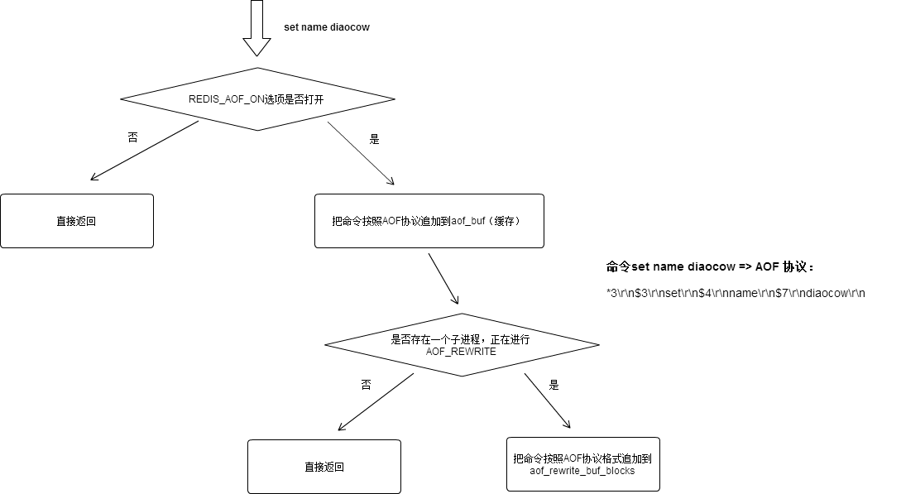

### Redis的AOF持久化
- AOF持久化是什么
- 为什么要使用AOF持久化
- 同时出现RDB、AOF的情况

由于Redis的数据都存放在内存中，如果没有配置持久化，redis重启后数据就全丢失了，于是需要开启redis的持久化功能，将数据保存到磁盘上，当redis重启后，可以从磁盘中恢复数据。redis提供两种方式进行持久化，一种是RDB持久化（原理是将Reids在内存中的数据库记录定时dump到磁盘上的RDB持久化），另外一种是AOF（append only file）持久化（原理是将Reids的操作日志以追加的方式写入文件）。
 
 ### AOF持久化
 1、定义
 
 AOF持久化以日志的形式记录服务器所处理的每一个写、删除操作，查询操作不会记录，以文本的方式记录，可以打开文件看到详细的操作记录。当aof持久化功能打开时，会将被执行的写命令追加到服务器状态的aof_buf缓冲区的末尾。
 
 2、AOF文件的格式
 ``` 
 *2
 $6
 SELECT
 $1
 0
 *6
 $5
 RPUSH
 $4
 list
 $1
 1
 $1
 2
 $1
 3
 $1
 4
 ```
 
 3、AOF的实现以及相关配置
 - 命令追加 
 - 文件写入
 - 文件同步
 
 服务器在执行命令后，会将命令以RESP协议的格式追加到aof_buf的缓冲区末尾;将缓冲区的这些命令写入aof文件中;最后在一定规则下同步到硬盘中。
 
 在**redis.conf**配置中，定义aof持久化的相关信息： 
``` c
appendonly no/yes               是否打开AOF功能
appendfilename "appendonly.aof" AOF文件名称
appendfsync always/everysec/no  同步频率
```
**同步频率**：
- always：每个redis命令都要同步写入硬盘
- everysec:每秒执行一次
- no:让操作系统来决定应该何时进行同步

4、源码小析

``` c
int startAppendOnly(void) {
    char cwd[MAXPATHLEN]; /* Current working dir path for error messages. */
    int newfd;
    //是否打开了aof功能
    newfd = open(server.aof_filename,O_WRONLY|O_APPEND|O_CREAT,0644);
    serverAssert(server.aof_state == AOF_OFF);
    if (newfd == -1) {
        char *cwdp = getcwd(cwd,MAXPATHLEN);
        serverLog(LL_WARNING,
            "Redis needs to enable the AOF but can't open the "
            "append only file %s (in server root dir %s): %s",
            server.aof_filename,
            cwdp ? cwdp : "unknown",
            strerror(errno));
        return C_ERR;
    }
    //正在执行rdb
    if (server.rdb_child_pid != -1) {
        server.aof_rewrite_scheduled = 1;
        serverLog(LL_WARNING,"AOF was enabled but there is already a child process saving an RDB file on disk. An AOF background was scheduled to start when possible.");
    } else {
        //正在执行aof
        if (server.aof_child_pid != -1) {
            serverLog(LL_WARNING,"AOF was enabled but there is already an AOF rewriting in background. Stopping background AOF and starting a rewrite now.");
            killAppendOnlyChild();
        }
        if (rewriteAppendOnlyFileBackground() == C_ERR) {
            close(newfd);
            serverLog(LL_WARNING,"Redis needs to enable the AOF but can't trigger a background AOF rewrite operation. Check the above logs for more info about the error.");
            return C_ERR;
        }
    }
    server.aof_state = AOF_WAIT_REWRITE;
    server.aof_last_fsync = server.unixtime;
    server.aof_fd = newfd;
    return C_OK;
}
```
5、AOF执行流程图:



Redis会不断地将被执行的命令记录到AOF文件里面，所以随着Redis不断运行，AOF文件的体积也会不断增长
- 里面会有大部分是重复命令或者可以合并的命令
- 还原操作执行时间就可能会非常长

这时候引出了AOF重写（bgrewriteaof）

6、AOF重写

**（1）AOF重写**
redis开一个子进程进行AOF重写的操作，该操作不会影响已经生成的aof文件，而是读取当前数据库的数据，用“一条命令”代替之前用多条命令插入的值，生成新的AOF文件替换就得AOF文件。可在redis.conf的配置中配置
```     
auto-aof-rewrite-percentage 100  
auto-aof-rewrite-min-size 64mb   
```
以上配置说明,当AOF文件大于64M,并且比上一次重写的体积大了至少一倍时，redis执行重写的命令

**（2）子进程在进行AOF重写时，其他子进程在对现有的数据进行修改，导致重写后的AOF文件和当前数据不一致，如何解决？**
aof重写缓存：从创建子进程开始，执行所有的写操作都会被记录到aof重写缓冲区中，当AOF重写结束时会给父进程发送一个完成信号，此时将缓冲区中的内容全部写到新的AOF文件，保证数据的一致性。最后完成新旧AOF文件的替换。

**（3）AOF重写造成内存暴涨，如何解决？**
内存暴增的原因：从上一个问题可以知道，AOF重写缓存的存在，如果在进行重写时，有大量的写操作，就会造成缓存所占内存过大，造成内存暴增。
解决办法：
- 改变AOF重写的配置
- 
**（4） AOF重写优点：**
- 减少AOF日志尺寸，减少内存占用，加快数据库恢复时间。

7、AOF文件出错了

使用redis自带的redis-check-aof程序，进行修复

#### 小结
  
| RDB | AOF |
| :------: | :------: |
|恢复数据时，RDB文件恢复数据远远快于AOF文件 | |
|RDB文件使用二进制格式保存 |aof使用保存写命令的文本文件|
|RDB文件比较小| AOF文件随着命令的叠加会越来越大，Redis提供了AOF重写来压缩AOF文件 |
|RDB持久化方式实时性不好，没有办法做到实时持久化或秒级持久化||


